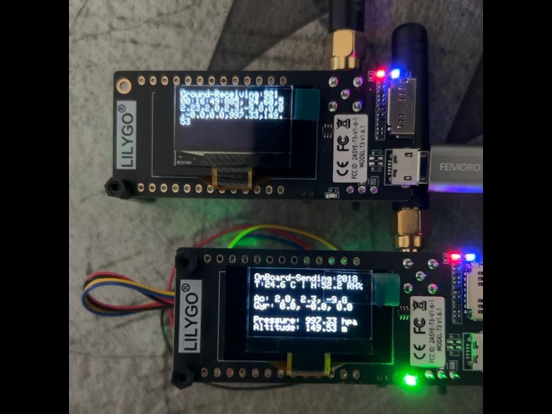

# Hardware Interfacing

A simple project demonstrating the interfacing of multiple I2C & SPI based sensors with an ESP32  based microcontroller using the Arduino core in the PlatformIO environment.

## Hardware Components
### Microcontroller
- [LILYGO LoRa32 915Mhz ESP32 Development Board OLED 0.96 Inch SD Card BLE WiFi TTGO Paxcounter Module](https://lilygo.cc/products/lora3) - An ESP32-based development board featuring built-in LoRa 915 MHz radio, a 0.96-inch OLED display, microSD card slot, and onboard Wi-Fi + Bluetooth capabilities. Ideal for low-power long-range IoT applications such as mesh networks, environmental monitoring, and Paxcounter-style projects. [github](https://github.com/Xinyuan-LilyGO/LilyGo-LoRa-Series/blob/master/docs/en/t3_v161_sx1276/t3_v161_sx1276_hw.md)

### Sensors
- [BMP390](https://www.adafruit.com/product/4816) - High-precision, low-noise barometric pressure and altitude sensor.

- [MPU-6050](https://www.adafruit.com/product/3886) - A 6-axis motion sensor combining a 3-axis accelerometer and 3-axis gyroscope for tracking motion and orientation.
- [Sensirion SHTC3](https://www.adafruit.com/product/4636) - Low-power, high-accuracy digital sensor for measuring temperature and humidity.
> **Note:** All sensors are breakout boards from Adafruit with good library support.
---
## Installation
- Install the CH9102 USB bridge driver for the first time. [Windows](https://www.wch-ic.com/downloads/CH343SER_ZIP.html), [Mac](https://www.wch-ic.com/downloads/CH34XSER_MAC_ZIP.html)
- Install [Visual Studio Code](https://code.visualstudio.com/).
- Open VS code and Go to Extensions.
- Search for "**PlatformIO IDE**" and install.
- Wait for Dependencies to Install.
    - PlatformIO will automatically install:
        - PlatformIO Core
        - Python environment
        - Required tools and boards
        - ⚠️ This may take a few minutes (especially the first time).
- Restart VS Code (if prompted)
- Verify Installation - After restarting, you’ll see a PlatformIO icon (alien head) on the sidebar.
---
## How to Run
- Click “**New Project**” in PlatformIO (PIO) Home.
- In the Project Wizard, provide:
    - Project name.
    - Board:     ESP32 Pico Kit (Espressif)
    - Framework: Arduino
    - Location 
    - ⚠️ This may take a few minutes (especially the first time).
- In PIO Home, open the Libraries section from the sidebar, search and add the required libraries for each project.
- The project structure will be something like:
    ```
    project/
        │── .pio/
        │── .vscode/
        │── include/
        │── lib/                   # Driver libraries
        │── src/
        │   └── main.cpp           # Main application
        │── platformio.ini
     
- Copy the source code into your project’s `src/main.cpp`.
- Copy the driver files from this repository’s `lib/` folder into your project’s `lib/` folder.
- Click the (**✔**) symbol in the lower left corner to compile/Build.
- Connect the board to the computer USB , Micro-USB is used for module fimware upgrade.
- Click (**→**) to upload firmware.
- Click on (**Upload and Monitor**) to upload firmware and monitor the Serial Monitor.

> **Note:** ground_receiver and on_board_transmitter are two separate projects developed on PlatformIO. Each project folder has its own README with wiring diagrams, interfacing details, and a brief project description.
---



The above image illustrates successful data transmission over the LoRa link.