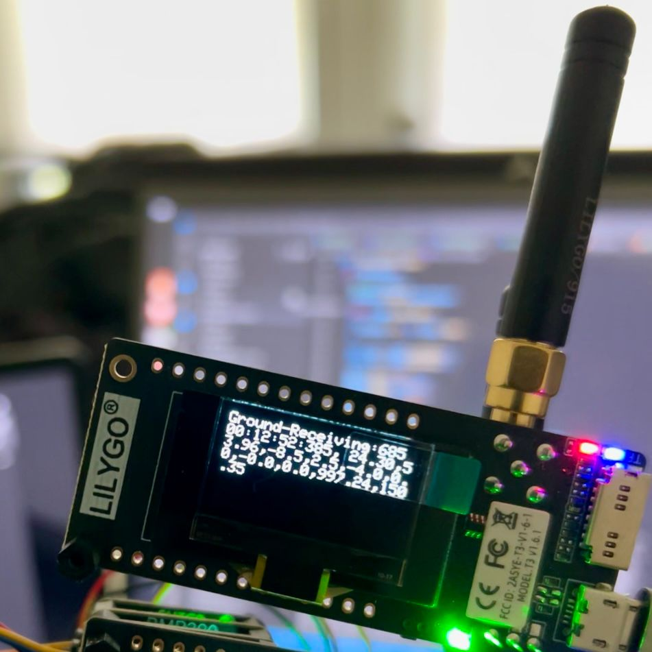

# Ground Receiver – LoRa & OLED Display
This project implements a LoRa receiver on LILYGO LoRa32 (ESP32 based) board with an SSD1306 OLED display. It continuously listens for incoming LoRa packets, extracts the transmitted sensor data, and displays it in real time on the OLED screen.

### Features
- LoRa SX1276 Support
    - Initializes the SX1276 LoRa transceiver  
    - Receives packets and parses incoming data  

- OLED Display (SSD1306, 128x64)
    - Displays up to 8 lines of text  
    - Clears and refreshes every update cycle  


### Required External libraries 
For this project, open PIO Home, go to Libraries in the PlatformIO sidebar. Search for and add the following libraries to your project:
- Adafruit GFX Library (optional)
- Adafruit SSD1306 (optional, for OLED display)
- LoRa by Sandeep Mistry

### Message Format

Each received LoRa packet is a comma-separated string containing sensor values such as:
```<time>, <temperature>, <humidity>, <accelX>, <accelY>, <accelZ>, <gyroX>, <gyroY>, <gyroZ>, <pressure>, <altitude>```
The receiver reads the full packet as a string and directly displays it on the OLED.

### Handling Packet Loss
- Dropped Packets: If a packet is lost in transmission, the OLED display simply retains the previous values.
- Corrupted Packets: If a packet is corrupted, the received string may appear garbled. There is no built-in checksum in this implementation


