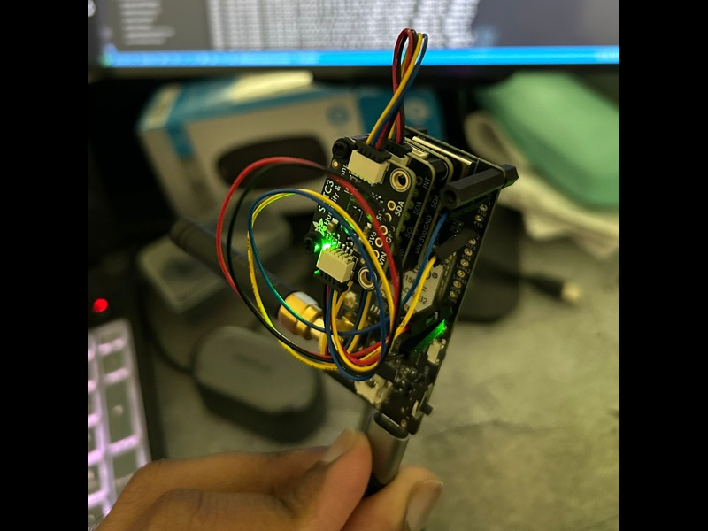
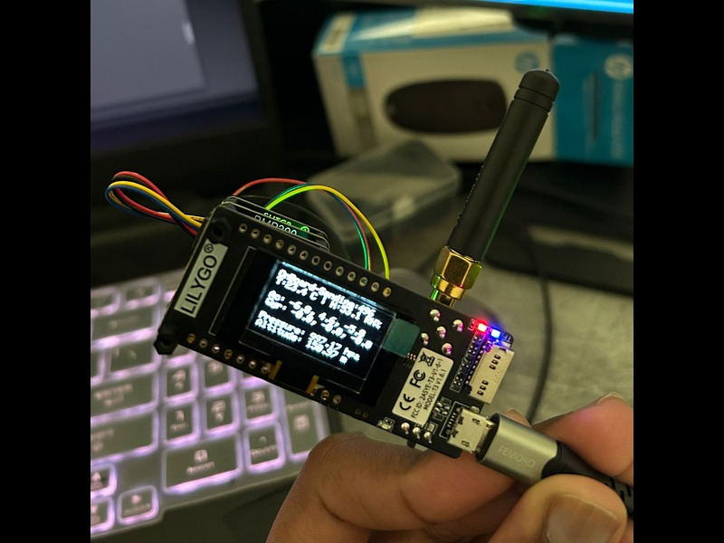

# On-Board Transmitter
- The system integrates SHTC3 (temperature and humidity), MPU6050 (acceleration and gyroscope), and BMP390 (pressure and altitude) sensors.
- It runs on an LILYGO LoRa32 (ESP32 based) board using PlatformIO.
- The acquired data is logged to an SD card, transmitted via LoRa, and displayed in real time on a 128×64 SSD1306 OLED screen.
## Features
- Initializes and manages:
    - SHTC3 – Temperature & Humidity
    - MPU6050 – 3-axis Accelerometer & Gyroscope
    - BMP390 – Pressure & Altitude
    - SSD1306 – OLED Display
    - SD Card – Local data logging
    - SX1276 LoRa Module – Wireless telemetry

- Periodically:
   - Sensors (I²C) → Read data (temperature, humidity, acceleration, gyroscope, pressure, altitude).
    - Data string formatted with timestamp.
    - Logged to microSD card (HSPI) for local storage.
    - Transmitted over LoRa (VSPI).
    - Displayed on OLED (I²C) in real time.


### Required External libraries 
For this project, open PIO Home, go to Libraries in the PlatformIO sidebar. Search for and add the following libraries to your project:
- Adafruit BMP3XX Library
- Adafruit SHTC3 Library
- Adafruit MPU6050
- Adafruit Unified Sensor
- Adafruit GFX Library (optional)
- Adafruit SSD1306 (optional, for OLED display)
- LoRa by Sandeep Mistry
---
## Sensor Interfacing and Data Display
### 1. Sensor Interfacing (I²C & SPI)
- The sensors SHTC3, MPU6050 and BMP390 use the I2C protocol.
- Wire.begin(21, 22) sets GPIO21 as SDA and GPIO22 as SCL on the board.
- Each sensor is connected in parallel on the same I2C bus and powered via 3.3V and GND.
- The LoRa SX1276 module is connected via the VSPI bus. SPI and control pins defined in lora_sx1276.cpp. 
- The microSD card is connected via the HSPI bus. SPI and control pins defined in sd_card.cpp.
- LoRa and SD are inbuilt on the LilyGO LoRa32 board and operate independently since they use different SPI buses.
- The I2C addresses are handled internally by the Adafruit libraries.

### 2. Message Transmission
- Sensor values are collected every 500 ms.
- Data is formatted into a comma-separated string (CSV) along with a timestamp.
- The formatted message is:
    - Logged locally to the microSD card via HSPI.
    - Transmitted wirelessly over LoRa (VSPI) to the ground receiver.
- The LoRa radio handles modulation and physical transmission at the configured frequency (e.g., 915 MHz depending on region).

### 3. Packet Format
Each transmitted packet follows this structure:
```<time>, <temperature>, <humidity>, <accelX>, <accelY>, <accelZ>, <gyroX>, <gyroY>, <gyroZ>, <pressure>, <altitude>```  

**Example Packet:**
This packet represents a single measurement cycle.


### Initial Wiring on a Breadboard


### Wiring with Adafruit Stemma QT 4-pin cable
Adafruit I²C breakouts use two 4-pin JST-SH connectors (in/out) for easy daisy-chaining without soldering.  
Key features:  
- Built-in 10kΩ pull-up resistors on SDA/SCL (fine for short chains, but may need removal on long chains to avoid overly strong pull-ups).  
- 3.3V/5V logic compatible with built-in level shifting for wide MCU support.  
- Each device requires a unique I²C address; configurable jumpers allow duplicates, otherwise use SPI or I²C multiplexer.





